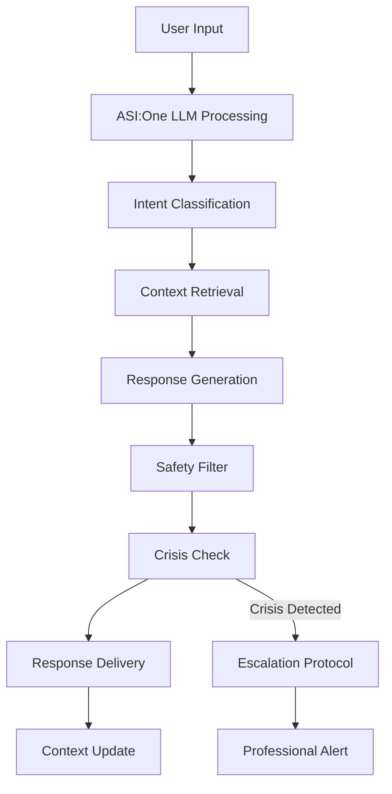
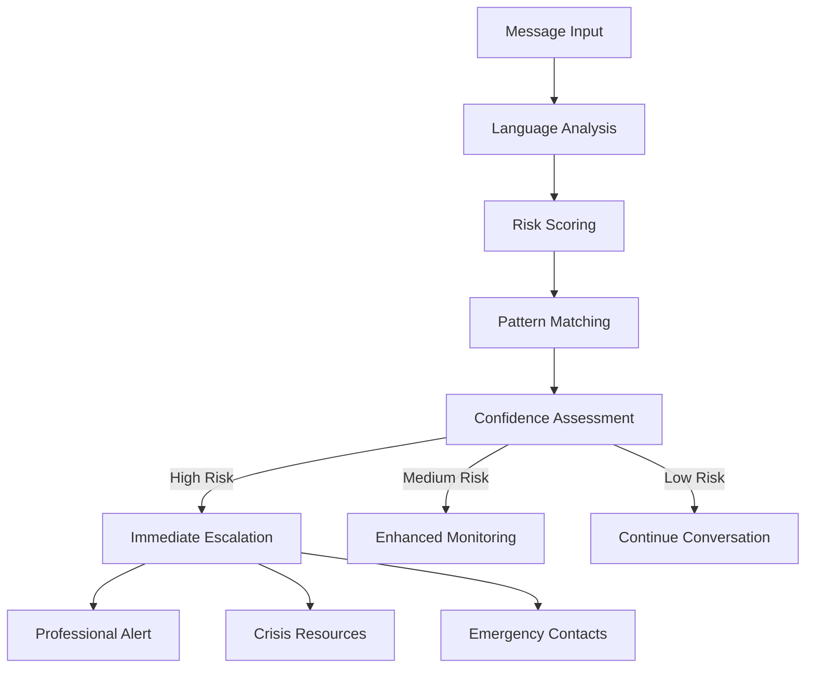

# Mental Wellness Coach - Project Planning & Architecture

*Version 2.0 - Updated for Python Flask Backend*  
*Last Updated: December 2024*

---

## 🎯 Project Vision & Purpose

**Mental Wellness Coach** is a privacy-first AI agent designed to provide daily emotional support and mental health maintenance through empathetic, intelligent conversations. Built on **ASI:One LLM** and **Fetch.ai's uAgents framework**, it serves as a trusted digital companion for mental wellness.

### 🌟 Mission Statement
To democratize access to mental health support by providing personalized, private, and professional-grade emotional guidance through advanced AI technology, while maintaining the highest standards of privacy and safety.

---

## 👥 User Personas & Use Cases

### 1. **Professional Paula** (Primary)
- **Demographics**: 28-45, knowledge worker, moderate-high income
- **Pain Points**: Work stress, work-life balance, burnout prevention
- **Goals**: Daily stress management, emotional regulation, career wellness
- **Usage Pattern**: Morning mood check-ins, evening reflection, crisis support
- **Key Features**: Stress tracking, coping strategies, work-life balance coaching

### 2. **Student Sam** (Secondary)  
- **Demographics**: 18-26, college/graduate student, tech-savvy
- **Pain Points**: Academic pressure, social anxiety, life transitions
- **Goals**: Emotional support, academic stress management, personal growth
- **Usage Pattern**: Daily journaling, pre-exam support, social anxiety help
- **Key Features**: Mood tracking, journaling prompts, anxiety management

### 3. **Caregiver Carol** (Tertiary)
- **Demographics**: 35-65, caring for family members, high stress
- **Pain Points**: Caregiver burnout, emotional exhaustion, isolation
- **Goals**: Self-care reminders, emotional processing, resilience building
- **Usage Pattern**: Quick check-ins, stress relief, emotional validation
- **Key Features**: Quick mood tracking, stress relief activities, self-care reminders

---

## 🏗️ System Architecture

### Technology Stack Overview

```
┌─────────────────────────────────────────────────────────────┐
│                    Mental Wellness Coach                    │
├─────────────────────────────────────────────────────────────┤
│  Natural Language Interface (ASI:One LLM)                  │
├─────────────────────────────────────────────────────────────┤
│  ┌─────────────┐ ┌─────────────┐ ┌─────────────┐          │
│  │ Mood Check  │ │ Journaling  │ │ Coping      │          │
│  │ Module      │ │ Companion   │ │ Toolkit     │          │
│  └─────────────┘ └─────────────┘ └─────────────┘          │
├─────────────────────────────────────────────────────────────┤
│  ┌─────────────┐ ┌─────────────┐ ┌─────────────┐          │
│  │ Escalation  │ │ Context     │ │ Privacy     │          │
│  │ Protocol    │ │ Manager     │ │ Controller  │          │
│  └─────────────┘ └─────────────┘ └─────────────┘          │
├─────────────────────────────────────────────────────────────┤
│  uAgents Communication Layer (Fetch.ai)                    │
├─────────────────────────────────────────────────────────────┤
│  Model Context Protocol (MCP) - Secure State Management    │
└─────────────────────────────────────────────────────────────┘
```

### Core Technology Components

- **ASI:One LLM**: Primary language understanding and generation
- **Fetch.ai uAgents**: Multi-agent coordination and communication  
- **Model Context Protocol (MCP)**: Secure state and memory management
- **React Native**: Cross-platform mobile application
- **Python Flask**: RESTful API server and backend services
- **PostgreSQL**: Encrypted metadata and analytics storage

---

## 🧩 Feature Architecture

### 1. Daily Mood Check-In Module

**Purpose**: Track emotional state through conversational interface
**Components**:
- Natural language mood assessment
- Emotional pattern recognition
- Trend analysis and insights
- Personalized follow-up questions

**AI Processing Flow**:
```
User Input → ASI:One LLM → Mood Classification → 
Pattern Analysis → Response Generation → Storage
```

### 2. Journaling Companion Module

**Purpose**: Guided reflection and emotional processing
**Components**:
- Intelligent prompt generation
- Sentiment analysis
- Emotional theme extraction
- Progress tracking

**Privacy Features**:
- Client-side encryption before storage
- Selective sharing controls
- Automatic expiration options

### 3. Coping Toolkit Module

**Purpose**: Interactive stress-reduction and emotional regulation
**Components**:
- Breathing exercises with biometric integration
- Mindfulness activities
- Cognitive behavioral techniques
- Progressive muscle relaxation

**Personalization**:
- Effectiveness tracking per user
- Adaptive recommendations
- Cultural and preference customization

### 4. Crisis Detection & Escalation Module

**Purpose**: Real-time risk assessment and professional intervention
**Components**:
- Multi-layer crisis detection
- Professional escalation protocols
- Emergency contact systems
- Safety resource provision

**Safety Measures**:
- Human oversight validation
- Multiple detection algorithms
- Immediate response protocols
- Professional network integration

### 5. Context Management Module

**Purpose**: Maintain conversation continuity and personalization
**Components**:
- Session state management
- Long-term memory patterns
- Preference learning
- Relationship building

**Technical Implementation**:
- MCP for secure state management
- Encrypted conversation history
- Privacy-preserving personalization

### 6. Privacy Controller Module

**Purpose**: User-controlled data management and privacy
**Components**:
- Granular consent management
- Data retention controls
- Encryption key management
- Right-to-be-forgotten implementation

---

## 🤖 AI/LLM Integration Flow

### Primary Conversation Flow



### Crisis Detection Pipeline



---

## 🔒 Security & Privacy Architecture

### Data Protection Layers

1. **Application Layer**:
   - Input validation and sanitization
   - Rate limiting and DDoS protection
   - Authentication and authorization

2. **Transport Layer**:
   - TLS 1.3 encryption for all communications
   - Certificate pinning
   - Perfect forward secrecy

3. **Storage Layer**:
   - AES-256 encryption at rest
   - Encrypted database fields
   - Secure key management

4. **Processing Layer**:
   - Privacy-preserving AI processing
   - Minimal data retention
   - Secure memory handling

### Compliance Framework

- **HIPAA Compliance**: Health information security standards
- **GDPR Compliance**: European privacy regulation adherence
- **Mental Health Ethics**: Professional counseling guidelines
- **Security Standards**: SOC 2 Type II, ISO 27001 alignment

---

## 🛠️ Technical Implementation

### Backend Architecture (Python Flask)

```
backend/
├── app.py                  # Flask application factory
├── config.py              # Environment-based configuration
├── models.py               # SQLAlchemy database models
├── routes/                 # API endpoint blueprints
│   ├── mood_routes.py      # Mood tracking endpoints
│   ├── journal_routes.py   # Journaling endpoints
│   ├── chat_routes.py      # AI conversation endpoints
│   └── auth_routes.py      # Authentication endpoints
├── services/               # Business logic layer
│   ├── ai_service.py       # ASI:One LLM integration
│   ├── agent_service.py    # Fetch.ai uAgents integration
│   └── crisis_service.py   # Crisis detection service
└── utils/                  # Utility functions
    ├── encryption.py       # Data encryption utilities
    └── validators.py       # Input validation
```

### Database Schema (PostgreSQL)

```sql
-- Core user management
Users: id, email, password_hash, created_at, preferences
UserProfiles: user_id, encrypted_data, consent_settings

-- Mental health data
MoodEntries: user_id, score, emotions[], timestamp, context
JournalEntries: user_id, encrypted_content, sentiment, themes[]
Conversations: user_id, session_id, context, risk_level

-- Crisis management
CrisisEvents: user_id, risk_level, escalated, resolution
ProfessionalContacts: user_id, contact_info, specialty
```

### Mobile Application (React Native)

```
mobile/
├── src/
│   ├── components/         # Reusable UI components
│   ├── screens/           # App screens
│   ├── services/          # API communication
│   ├── utils/             # Helper functions
│   └── navigation/        # App navigation
├── assets/                # Images, fonts, etc.
└── __tests__/            # Test files
```

---

## 📈 Development Roadmap

### MVP Scope (Phase 1) - Weeks 1-8

**Core Features**:
- ✅ Basic mood check-in functionality
- ✅ Simple AI conversation interface
- ✅ User authentication and security
- ✅ Crisis detection (basic)
- ⏳ Mobile app foundation

**Deliverables**:
- Functional mood tracking
- Basic AI conversations
- Crisis safety measures
- MVP mobile app

### Enhanced Features (Phase 2) - Weeks 9-16

**Advanced Features**:
- AI-guided journaling
- Personalized coping activities
- Advanced crisis detection
- Professional integration
- Analytics dashboard

**Deliverables**:
- Complete feature set
- Professional network integration
- Advanced personalization
- Compliance certification

### Scale & Polish (Phase 3) - Weeks 17-24

**Platform Readiness**:
- Performance optimization
- Advanced security features
- Multi-language support
- Professional dashboard
- Research integration

**Deliverables**:
- Production-ready platform
- Professional tools
- Research collaboration features
- International expansion ready

---

## 📊 Success Metrics & KPIs

### User Engagement Metrics
- **Daily Active Users** (Target: 70% retention Day 7)
- **Session Duration** (Target: 5-10 minutes average)
- **Feature Adoption** (Target: 80% use core features within week 1)
- **User Satisfaction** (Target: NPS >50)

### Mental Health Impact Metrics
- **Mood Improvement** (Target: 15% improvement in mood scores over 30 days)
- **Crisis Prevention** (Target: 95% successful crisis interventions)
- **Professional Referrals** (Target: 80% follow-through on referrals)
- **User-Reported Outcomes** (Target: 70% report positive impact)

### Technical Performance Metrics
- **Response Time** (Target: <2 seconds average)
- **System Uptime** (Target: 99.9%)
- **Data Security** (Target: Zero security incidents)
- **Privacy Compliance** (Target: 100% compliance with all regulations)

---

## 🎨 Design System & Style Guide

### Visual Identity
- **Primary Colors**: Calming blues and greens
- **Typography**: Clear, accessible fonts (Inter, SF Pro)
- **Iconography**: Consistent, empathetic icon set
- **Imagery**: Diverse, inclusive, calming photography

### UX Principles
- **Simplicity**: Minimal cognitive load
- **Accessibility**: WCAG 2.1 AA compliance
- **Empathy**: Warm, understanding tone
- **Trust**: Transparent privacy controls

---

## 🔮 Future Enhancements & Research

### Advanced AI Features
- Multi-modal interaction (voice, text, image)
- Predictive mental health insights
- Personalized intervention timing
- Cultural and linguistic adaptation

### Platform Extensions
- Professional therapist integration
- Family/support network features
- Group therapy facilitation
- Research participation platform

### Research Opportunities
- Mental health outcome studies
- AI conversation effectiveness research
- Privacy-preserving mental health analytics
- Cross-cultural mental health patterns

---

**Document Status**: ✅ Complete  
**Next Review**: January 2025  
**Maintained By**: Mental Wellness Coach Development Team 